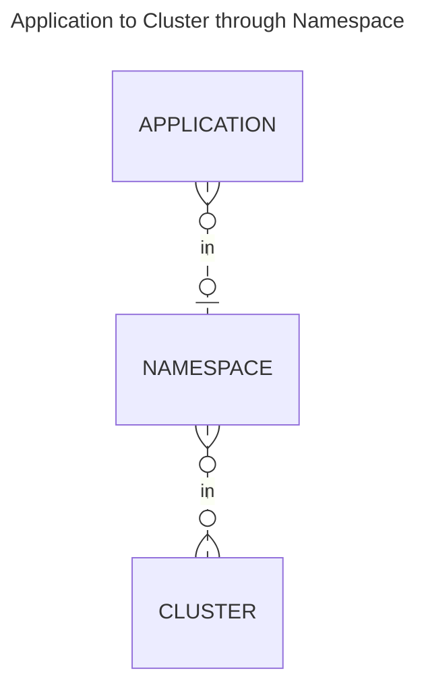

# Application/Cluster Matching

Res-Edge creates the relationship between an application and a cluster/set of clusters by generating manifests and placing them in the gitops repo for the specific cluster.

- Clusters are associated with namespaces via the [Included Clusters Expression](/docs/included_clusters_expression.md) on the namespace.
- Applications are associated to a namespace
- During Automation step, the application manifests are generated for each cluster that they are associated with through the namespace relationship.

