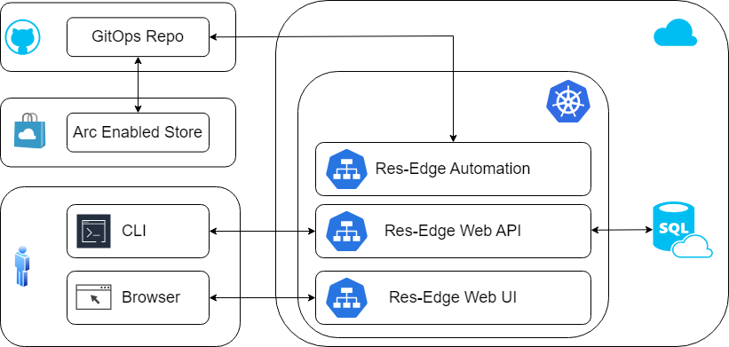

# Resilent Edge Overview

This is a test

Resilient Edge (Res-Edge) is a composition of tools designed to streamline application manageability across a highly distributed application platform. The objective is to leverage a small platform team to support a highly distributed ecosystem of clusters and apps.

- Developer Productivity
  - Enable inner-loop and outer-loop development processes that provide a robust and low-friction way to manage the full code lifecycle which allows customers to evolve their SDLC to meet their business needs.
  - Res-Edge inner-loop is an extension of the Kubernetes in Codespaces inner-loop that we have been successful with for over 3 years now. The main extension is the ability to deploy, test, and observe Res-Edge within a developer's Codespace. This allows the Platform Team to get Res-Edge running with minimal friction - often within an hour.
- Scalable Operations on the Edge
  - Enable customers to manage their distributed environments across geographies, franchisees, and stores in a way that maximizes flexibility, resiliency, and velocity while minimizing costs.
  - Res-Edge builds on top of concepts from Coral and PiB and also addresses the scale issues that both encountered. Specifically, the growth in config files as clusters * applications grows to 1M or more.
  - Res-Edge is the next step in getting to one platform. PiB is already retired in lieu of Res-Edge.

The Edge brings unique challenges. One of the first challenges is rather than a few large clusters the Edge has 10s of thousands of small clusters connected by a mostly reliable network. As examples, Chick-fil-A has 2500 stores, Walmart has 11K, Domino's has 30K, McDonald's has 39K, and Yum has over 60K. Our current, and immediate future, tooling is not designed to handle 30K clusters. Rather, it is targeted at 10s of clusters running in Azure.

Retailers like Walmart and CFA deploy multiple times per day to the Edge. This is a key differentiator vs. other industries like Manufacturing. Retail also has a constant stream of data flowing back to the Data Center.

As an example, the Domino's Pizza Tracker automatically updates during the delivery experience. The customer gets notified when the store gets the order, begins making the order, begins baking the order, sends the order for delivery, a 2 minute warning, driver arrived, and delivery completed. If any step doesn't meet the Domino's SLA, the customer gets an email with an apology and an offer for a discount or additional loyalty points. This requires near real-time data flows between the stores and the e-commerce system.

# Res-Edge System Diagram

- Res-Edge Data Service
  - The Data Service is a REST API and is the core of the system
  - The Data Service is flexible enough to promote additional scenarios and rigid enough to be repeatable
  - The CLI, Dashboard, and GitHub Actions use the Data Service
  - We expect customers will build tools that use the Data Service
- SQL Azure
  - SQL Azure is used to store the Res-Edge data
- GitOps
  - The GitHub Action is used for GitOps CI-CD
  - The Action combines the values from the Data Service with the GitOps repo to create Kubernetes manifests for each cluster
  - These manifests are applied by Flux running on each Cluster
- Res-Edge Dashboard
  - The Dashboard is a Web UI used by the Platform and Application teams
- CLI
  - The CLI is used by advanced users and for automation
