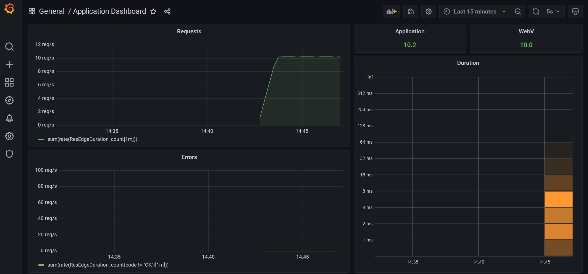

# Debugging the Application Dashboard

In Grafana, it is important to understand why we are seeing `10.2` requests per second under the Application Dashboard rather than the `10` requests per second we see under WebV.

The `10.2` requests per second are calculated from the following:

- Kubernetes (K8s) generates a liveness probe to /healthz every 1 min
- Promethus "scrapes" /metrics every 5 seconds, so the app "responds" with an extra .2 RPS
- WebV sends 10 requests per second to the api

In this lab we will learn how to stop and restart a deployment and debug when we see an irregular number in the dashboard by enabling first the `.2 requests per second` from the API and then the `10 requests per second` from WebV.

When the API and WebV are running, the Application Dashboard should appear as below:



## Prerequisites

- The Res-Edge Data Service needs to be deployed for this lab
  - Go to [Deploy Res-Edge Data Service lab](./deploy-res-edge.md#inner-loop-with-res-edge) to deploy the data service to the cluster

## Stopping the API and WebV deployments

We are going to first stop the API and WebV deployments we started in the previous lab to reset the metrics.

> `kdelf` is an alias for `kubectl delete -f`

- Delete the WebV deployment

  ```bash

  # start in the deploy directory
  cd $KIC_BASE/deploy

  kdelf webv/deployment.yaml

  ```

- Delete the API deployment

  ```bash

  kdelf api/deployment.yaml

  # should no longer see webv or api pods
  kic pods

  ```

## Redeploy API

```bash

# deploy the Res-Edge Data Service
kak api

# "watch" for the api pod to get to 1/1 Running
# ctl-c to exit
kic pods --watch

# verify Res-Edge Data Service is `Running`
ds check resedge

```

## View Application Dashboard in Grafana

- Go to the Grafana Application Dashboard we opened in the Deploy Res-Edge lab
- You should see the Application Dashboard with both WebV and Res-Edge Data Service ("Application")
  - WebV will have `0` requests per second because we stopped the WebV app (WebV takes some time to wind down so you may not see this right away)
  - Application will have `0.2` requests per second
- Keep "Application Dashboard" open in a browser tab to monitor Res-Edge Data Service requests metrics for the next section

## Open k9s for Logs

- Start `k9s` from the Codespace terminal
- Press `0` to show all `namespaces`
- Select `api` pod and press `l` to review the Res-Edge Data Service logs
  - Let the logs run for about 2 mins
- Press `s` to turn off `autoscroll`
- Press `w` to turn on `wrap` for better visibility

## Diving deeper into the Logs

- **Api is up and running**

  We can see in the [api/deployment.yaml](./deploy/api/deployment.yaml) that we have a startup probe set to call `/readyz` to check when the api is up and running:

  ```yaml

  startupProbe:
    httpGet:
      path: /readyz
      port: http
    initialDelaySeconds: 5
    failureThreshold: 60
    periodSeconds: 2

  ```

  - In k9s, this log will appear as follows:

    ```json

    {
      "date": "2023-05-12T22:21:10.9878166Z",
      "level": "Information",
      "ElapsedMilliseconds": 93.8659,
      "StatusCode": 200,
      "Method": "GET",
      "zone": "dev",
      "region": "dev",
      "RequestPath": "/readyz",
      "version": "0.9.0-0509-1854"
    }

    ```

  - Alternatively, in the cli we can run the following command to just return the `readyz` logs:

    ```bash

    ds logs resedge | grep readyz

    ```

- **K8s Healthcheck every minute**

  - Another setting we have in the [api/deployment.yaml](./deploy/api/deployment.yaml) is set a `livenessProbe` to call `/healthz` after a specified interval.
    - `periodSeconds` configures the api to run a GET call to `/healthz` every `60` seconds

    ```yaml

    livenessProbe:
      httpGet:
        path: /healthz
        port: http
      initialDelaySeconds: 5
      failureThreshold: 10
      periodSeconds: 60

    ```

  - In k9s, these logs will appear as follows:

    ```json

    // notice the timestamp between the two logs are 60 seconds between each other
    {
      "date": "2023-05-12T22:05:45.8828087Z",
      "level": "Information",
      "ElapsedMilliseconds": 8.0708,
      "StatusCode": 200,
      "Method": "GET",
      "zone": "dev",
      "region": "dev",
      "RequestPath": "/healthz",
      "version": "0.9.0-0509-1854"
    }

    {
      "date": "2023-05-12T22:06:45.8839286Z",
      "level": "Information",
      "ElapsedMilliseconds": 8.4692,
      "StatusCode": 200,
      "Method": "GET",
      "zone": "dev",
      "region": "dev",
      "RequestPath": "/healthz",
      "version": "0.9.0-0509-1854"
    }

    ```

  - Alternatively, in the cli we can run the following command to just return the `healthz` logs:

    ```bash

    ds logs resedge | grep healthz

    ```

- **Prometheus Scrape and Export**

  - We know by looking at the [prometheus/2-config-map.yaml](./deploy/monitoring/prometheus/2-config-map.yaml) file under the `global` section that Prometheus scrapes /metrics for logs and exports them to Grafana during a specified interval.
    - `scrape_interval` configures Promethus to scrape `/metrics` every `5` seconds
    - `evaluation_interval` configures Promethus to export the metrics to Grafana every `5` seconds

  ```yaml

    prometheus.yml: |-
      global:
        scrape_interval: 5s
        evaluation_interval: 5s

  ```

  - In k9s, these logs will appear as follows:

    ```json

    // notice the timestamp between the two logs are 5 seconds between each other
    {
      "date": "2023-05-12T22:06:39.7438317Z",
      "level": "Information",
      "ElapsedMilliseconds": 4.3562,
      "StatusCode": 200,
      "Method": "GET",
      "zone": "dev",
      "region": "dev",
      "RequestPath": "/metrics",
      "version": "0.9.0-0509-1854"
    }

    {
      "date": "2023-05-12T22:06:44.7434026Z",
      "level": "Information",
      "ElapsedMilliseconds": 3.8298,
      "StatusCode": 200,
      "Method": "GET",
      "zone": "dev",
      "region": "dev",
      "RequestPath": "/metrics",
      "version": "0.9.0-0509-1854"
    }

    ```

  - Alternatively, in the cli we can run the following command to just return the `metrics` logs:

    ```bash

    ds logs resedge | grep metrics

    ```

## Redeploy WebV

When we have WebV running, we will see the 10 GET requests per second on top of our other api logs in the Application Dashboard in Grafana.

```bash

# deploy WebV
kak webv

# "watch" for the webv pod to get to 1/1 Running
# ctl-c to exit
kic pods --watch

# verify WebV is `Running`
ds check webv

```

- In k9s, these logs will appear as follows:

  ```json

  {
    "date": "2023-05-12T22:58:51.6861887Z",
    "level": "Information",
    "ElapsedMilliseconds": 9.5128,
    "StatusCode": 200,
    "Method": "GET",
    "QueryString": "?$select=id,name,description,environment,gitOpsRepo,gitOpsBranch,tags,metadata,capacity,namespaces&$expand=namespaces($expand=applications($select=id,name,description,tags,metadata,environment,namespaceId,pat,path,businessUnit,owner,capacity);$select=id,name,description,tags,metadata,environment,businessUnit,capacity)",
    "zone": "dev",
    "region": "dev",
    "RequestPath": "/api/v1/clusters/17",
    "version": "0.9.0-0509-1854"
  }

  ```

- Alternatively, in the cli we can run the following command to return the `webv` logs:

  ```bash

  ds logs webv

  ```
